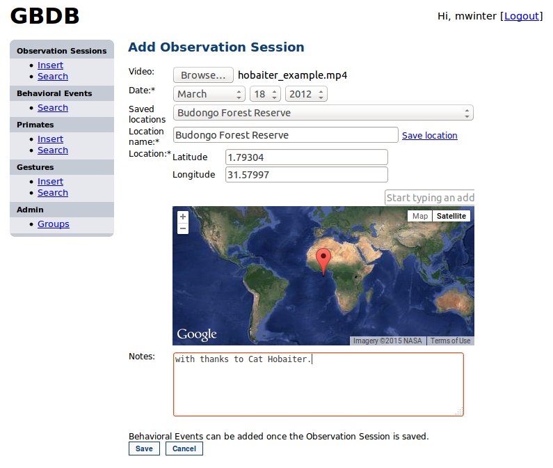

.. _insert-data:

Inserting Data
==============

    GBDB main page

After logging in, the user comes to the GBDB main page where you can choose to insert or search for data. While a user can choose to enter Observation Sessions, Primates, Gestures at this point from the navigation bar on the left, all these data can also be entered (including Behavioral and Gestural Events) through the process of adding an Observation Session. To simplify the documentation, we will take you through this process.

.. _insert-observation-session:

Insert Observation Session
--------------------------

After the user clicks "Insert" from navigation bar header of Observation Session, the following screen will appear:

    The Observation Session insert page
    
At this point the user can select a video file to upload, set the date of the Observation Session, and set the Location. There are several saved Locations to choose from. If your location is unlisted, you can save a new location by using the google maps interface. There is also a section to add general notes about the observation session. 

Finally, click save to save the observation which will bring up the view of that session where you can add Behavioral events. To the left is the information about the Observation session and to the right is the uploaded video with a timeline.

    The Observation Session view page
    
    
.. _insert-behavioral-event:

Insert Behavioral Event
-----------------------

    Inserting a Behavioral Event
    
Start Time and Duration
^^^^^^^^^^^^^^^^^^^^^^^
Clicking the "Add New" button on this page brings up a dialog under the video uploaded to the Observation Session and a pair of selectors appears in yellow above the timeline of the video. Use these selecters to select a range in the timeline that the event occurs. This will automatically set the Start Time and Duration of the event.

Select Primates
^^^^^^^^^^^^^^^^^^^^^^ 
In the primates section, you can select from primates that are already in the database. If the primate does not exist, clicking on the "Add Primate" button will pop up a dialogue box to enter a new primate (see :ref:`insert-primate`).

Contexts and Ethograms
^^^^^^^^^^^^^^^^^^^^^^^
To enter contexts and ethograms, use the text boxes that will autocomplete if the context or ethogram is in the database. Contact the web administrator to request a new context or ethogram.

Notes
^^^^^
Similarly to the Observation Session, you can add notes specific to the Behavioral Event.

Save
^^^^^
Clicking will save the event and update the Observation Session view to show the period of the event in the timeline and the details of the event under the Observation Session details with exception of the notes, which are displayed below the video.

    Observation Session view after saving a behavioral event
    
.. _insert-subevent:

Insert Behavioral or Gestural Subevent
--------------------------------------

.. figure:: images/add_gestural_subevent.png
    :align: center
    :figclass: align-center

    Inserting a Gestural Subevent
    
Once you add a Behavioral Event, subevents can be added by clicking the "Add New" link in the Behavioral Event box to the left. Adding a Behavioral Subevent is the same as adding a Behavioral Event. So here we show how to add a Gestural Subevent explaining only the distinct fields (for all others, see :ref:`insert-behavioral-event`).

Type
^^^^
Here, you can determine whether to add a Generic Behavioral Subevent (which is the same as the higher level Behavioral Event) or a Gestural Subevent which creates a different form. Entry of Start Time, Duration, Contexts, Ethograms, and Notes are the same as a Behavioral (Sub)event. The following events explain the unique aspects of the form.

Primates (Signaller and Recipient)
^^^^^^^^^^^^^^^^^^^^^^^^^^^^^^^^^^
In a Gestural Subevent, you determine the Primates acting as Signaller and Recipient in the gesture. If the gesture does not exist you can also add new Primates.

Select Gesture
^^^^^^^^^^^^^^
In the gesture section, you can select from gestures that are already in the database. If the gesture does not exist, clicking on the "Add Gesture" button will pop up a dialogue box to enter a new primate (see :ref:`insert-gesture`).

Recipient Response
^^^^^^^^^^^^^^^^^^
Here, on top of general notes, you can add notes specific to the Recipient Response.

Goal met
^^^^^^^^
This selection indicates whether or not the Goal of the gesture was met.

Save
^^^^^
Clicking will save the subevent and update the Observation Session view to show the period of the subevent in the timeline and the details of the subevent within the higher-level Behavioral Event with exception of the notes, which are displayed below the video.

    Observation Session view after saving a behavioral event
    
    
.. _insert-primate:

Insert Primate
---------------

    Inserting a Primate
    
Here you can assign a name to the primate, select/set her species, gender, birth date, and habitat (wild or captive). Similarly to location of an Observation Session, you can also set the location of the primate using a saved location or by entering a new location.

.. _insert-gesture:

Insert Gesture
---------------

A Gesture is represented as a separate table in GBDB. Here you can select from a list of Gestures in the database or create a new one.

    Inserting a Gesture
    
A Gesture is defined by a Name, Description, Goal, Signaller and Recipient body parts, and whether or not the Gesture is Audible. The Goal dropdown is prepopulated. Contact the the web administrator if your desired Goal needs to be added. To select body parts simply select any number of body parts involved using ctrl+click for multiple selections. You can also not select a body part in case one is not involved.
