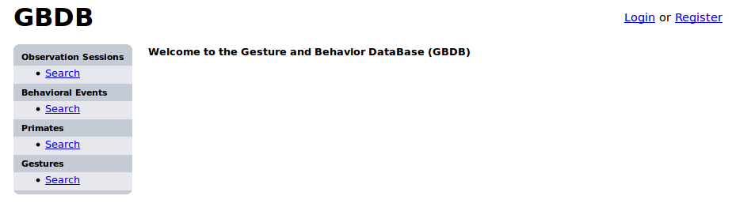

User Login and Registration
===========================

When you first go to GBDB, at the top right, there are links to login into the site or register for an account.

    Login/register

If you already have an account, you can enter your username and password after clicking the "Login" link. 

    Login page

If you do not have an account, click on the "Register" link, which will take you to the following form:

    Registration page

Enter your desired username, email address, password (twice), first and last name, and affiliation. Once you prove that you are not a robot and click "Register", an email will be sent to this address with an activation link. Clicking on the activation link will activate your account and take you back to GBDB where you can login as described above.
